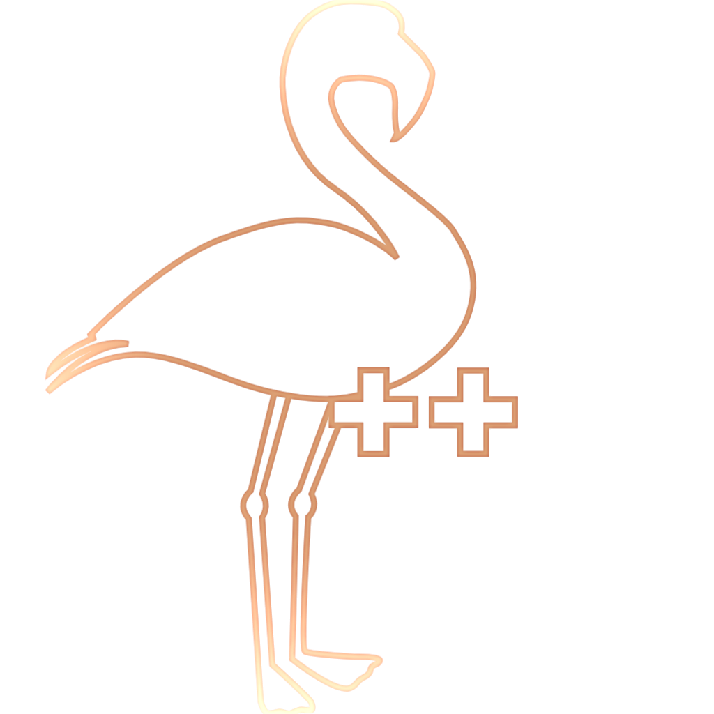

<!-- PROJECT SHIELDS -->
[![Issues][issues-shield]][issues-url]

<!-- PROJECT LOGO -->
 

  

<h3 align="center">Flamingo++' Project with the Salisbury Zoo </h3>

  

    Our mission is to program a website to record and manage welfare data of each of the animals at the Salisbury Zoo  
     
    <a href="">View Demo (NWY)</a>
  

<!-- TABLE OF CONTENTS -->

  
Table of Contents

  <ol>
    <li><a href="#about-the-project">About The Project</a><li>
    <li><a href="#usage">Usage</a></li>
    <li><a href="#roadmap">Roadmap</a></li>
    <li><a href="#contact">Contact</a></li>
  </ol>

<!-- ABOUT THE PROJECT -->
## About The Project
Welcome to the Salisbury Zoo's animal welfare project! This website was created to serve as a centralized database for the Salisbury Zoo's animal care. 

The Salisbury Zoo animal welfare management project is an important initiative that will help ensure that the zoo's animals receive the best possible care while taking away from the strain of manually inputting data into a spreadsheet by creating a website that manages data from welfare assessments of the animals includes the following aspects. 

In this project, these systems are utilized: 

- User management system (UM) 
- Digitized forms for recording pertinent information specific to the class or species of animal
  - Additional sections to write down notes or concerns
- Visualization software to allow zookeepers to view stylized data and trends
- Database to store the information

See <a href="#roadmap">Roadmap</a> for an in-depth look at the timeline of our goals for this project

(<a href="#readme-top">back to top</a>)

<!-- USAGE EXAMPLES -->
## Usage

Use this space to show useful examples of how a project can be used. Additional screenshots, code examples and demos work well in this space. You may also link to more resources.

(<a href="#readme-top">back to top</a>)

<!-- ROADMAP -->
<!-- Add real timeline-->
## Roadmap
- [ ] Database
    - [x] Creating a non-redundant schema 
    - [x] Adding templated forms 
    - [ ] Populating the database
- [ ] User Management Software
    - [ ] General account management
    - [ ] Admin privileges 
- [ ] Website
    - [ ] Create the wireframe for each of the pages
    - [ ] Assembling
    - [ ] Altering data in the database
    - [ ] Interactive welfare assessment form
- [ ] Visualization Software
    - [ ] Creation or implementation

To view the timeline press <a href="https://github.com/orgs/Salisbury-University/projects/12/views/6?layout=roadmap&groupedBy%5BcolumnId%5D=Milestone">here</a>

<!-- CONTACT -->
<!-- Need to add what everyone generally contributed to at the end!-->
## Contact
* George Fotiou - Project Leader
  *  gfotiou1@gulls.salisbury.edu
* David Wagner
  *  dwagner1@gulls.salisbury.edu
* Rachel Prusacki
  *  rprusacki1@gulls.salisbury.edu
* Josh Brull
  *  jbrull1@gulls.salisbury.edu

(<a href="#readme-top">back to top</a>)

<!-- ACKNOWLEDGMENTS 
## Acknowledgments

* 
* 
* 

(<a href="#readme-top">back to top</a>)

-->

<!-- MARKDOWN LINKS & IMAGES -->
<!-- https://www.markdownguide.org/basic-syntax/#reference-style-links -->
[issues-shield]: https://img.shields.io/github/issues/Salisbury-University/animal-welfare.svg?style=for-the-badge
[issues-url]: https://github.com/Salisbury-University/animal-welfare/issues
[logo]: "Images/fpp-full.png
[Sqlite.js]: https://img.shields.io/badge/sqlite-000000?style=for-the-badge&logo=sqlite&logoColor=white
[Sqlite-url]: https://sqlite.org/
